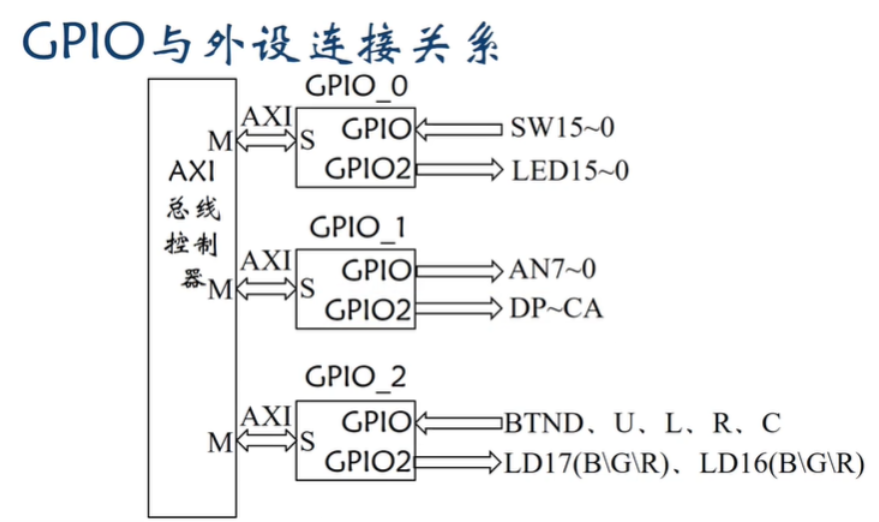
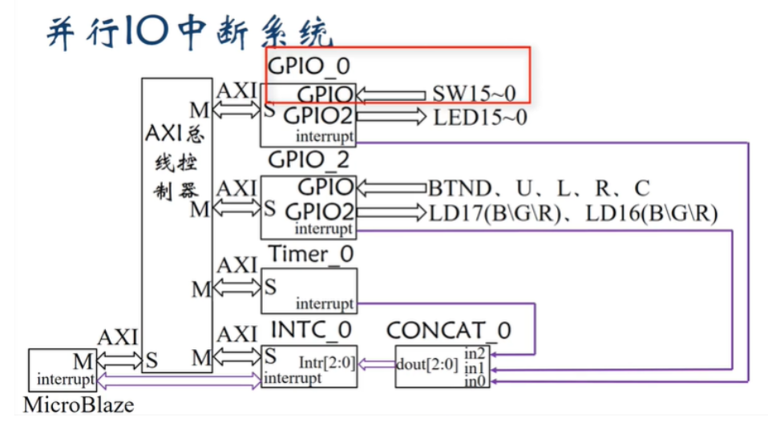
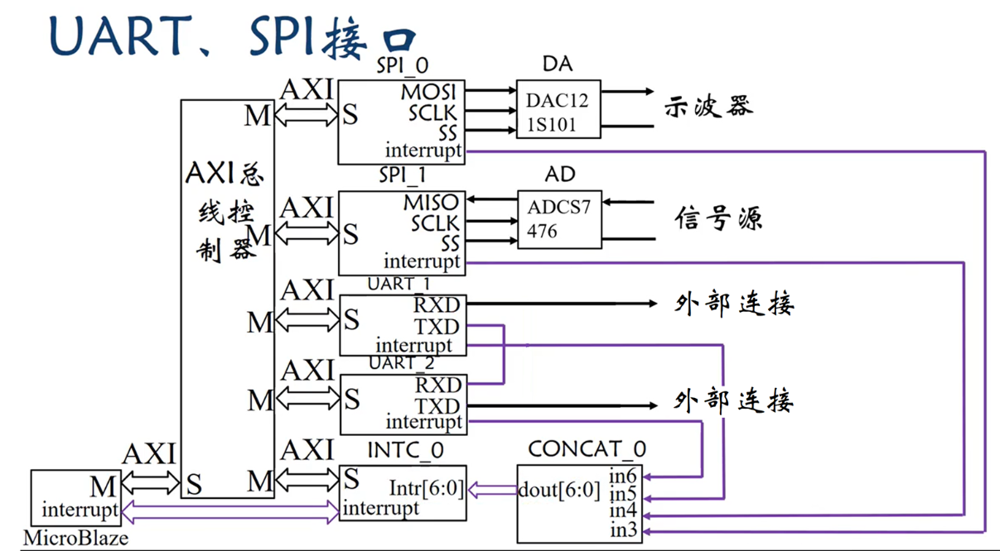

## 硬件平台
<p align="center">
    
    
    
</p>

## 

## 数码管显示模块

### 段码表

```c
char segcode[17] = {0xc0, 0xf9, 0xa4, 0xb0, 0x99, 0x92, 0x83, 0xf8, 0x80, 0x90, 0x88, 0x83, 0xc6, 0xa1, 0x86, 0x8e, 0xff};
```


| segcode[]         | 显示数字     |
| ----------------- | ------------ |
| segcode[0]  0xc0  | 0            |
| segcode[1]  0xf9  | 1            |
| segcode[2]  0xa4  | 2            |
| segcode[3]  0xb0  | 3            |
| segcode[4]  0x99  | 4            |
| segcode[5]  0x92  | 5            |
| segcode[6]  0x83  | 6            |
| segcode[7]  0xf8  | 7            |
| segcode[8]  0x80  | 8            |
| segcode[9]  0x90  | 9            |
| segcode[10]  0x88 | A            |
| segcode[11]  0x83 | b            |
| segcode[12]  0xc6 | C            |
| segcode[13]  0xa1 | d            |
| segcode[14]  0x86 | E            |
| segcode[15]  0x8e | F            |
| segcode[16]  0xff | NULL(不显示) |

### 按键值对应

| 按键值  | 按键名称 |
| ------- | -------- |
| 0x01    | BTNC     |
| 0x02    | BTNU     |
| 0x04    | BTNL     |
| 0x08    | BTNR     |
| 0x10    | BTND     |


### 代码

1. 数码管显示开关右边8位的二进制值
```c
void segTimerCounterHandler() {
	u8 seg = 0xFF;                         // 默认关闭所有段（不亮）
    u8 pos = ~(1 << scan_index);          // 计算位选信号，scan_index 表示当前要显示第几位，最右边为第0位
	u8 bit_val = (low_byte >> scan_index) & 0x01;// 取出当前要显示位的值，0或1
	seg = segcode[bit_val];

	Xil_Out8(XPAR_AXI_GPIO_1_BASEADDR + XGPIO_DATA2_OFFSET, seg);
	Xil_Out8(XPAR_AXI_GPIO_1_BASEADDR + XGPIO_DATA_OFFSET, pos);

    scan_index = (scan_index + 1) % 8;//实现循环扫描
    Xil_Out32(XPAR_AXI_TIMER_0_BASEADDR + XTC_TCSR_OFFSET, Xil_In32(XPAR_AXI_TIMER_0_BASEADDR + XTC_TCSR_OFFSET));  // 清除中断
}
```


## 示例代码

### 加法、乘法实现；数码管、led灯显示
- 点击BTNC 按键时，计算机读入一组16 位独立开关状态作为第一个输入的二进制数据，并即时显示输入的二进制数到16 位LED 灯上。（没有按下BTNC按键时，开关拨动不读入数据）
- 点击BTNR 按键时，计算机读入另一组16 位独立开关状态作为第二个输入的二进制数据，并即时显示输入的二进制数到16 位LED 灯上。（没有按下BTNR按键时，开关拨动不读入数据）
- 点击BTNU 按键时，将保存的2 组二进制数据做无符号加法运算，并将运算结果输出到LED 灯对应位。
- 点击BTND 按键时，将保存的2 组二进制数据做无符号乘法运算，并将运算结果输出到LED 灯对应位。
    
```c


#include <stdio.h>
#include "xil_io.h"
#include "xgpio.h"
#include "xil_printf.h"
#include "xintc.h"
#include "xparameters.h"
#include "xil_exception.h"
#include <stdint.h>


#define GPIO_DATA_OFFSET     0x0
#define GPIO_TRI_OFFSET      0x4
#define GPIO_DATA2_OFFSET    0x8
#define GPIO_TRI2_OFFSET     0xC

#define BTNC 0x01
#define BTNU 0x02
#define BTNR 0x08
#define BTND 0x10

volatile uint16_t a = 0, b = 0;

int main()
{
    uint8_t button = 0;

    // 配置GPIO_0通道1（开关）为输入，写1表示输入
    Xil_Out16(XPAR_GPIO_0_BASEADDR + XGPIO_TRI_OFFSET, 0xFFFF);
    // 配置GPIO_0通道2（LED）为输出，写0表示输出
    Xil_Out16(XPAR_GPIO_0_BASEADDR + XGPIO_TRI2_OFFSET, 0x0000);

    // 配置GPIO_2通道1（按键）为输入，低5位按键有效
    Xil_Out8(XPAR_GPIO_2_BASEADDR + XGPIO_TRI_OFFSET, 0x1F);

    while(1)
    {
        // 读按键值，只取低5位
        button = Xil_In8(XPAR_GPIO_2_BASEADDR + XGPIO_DATA_OFFSET) & 0x1F;
        if(button != 0)
        {
            // 等待按键松开，消抖
            while((Xil_In8(XPAR_GPIO_2_BASEADDR + XGPIO_DATA_OFFSET) & 0x1F) != 0);

            switch(button)
            {
                case BTNC:
                    // 读开关，存a，显示a
                    a = Xil_In16(XPAR_GPIO_0_BASEADDR + XGPIO_DATA_OFFSET);
                    Xil_Out16(XPAR_GPIO_0_BASEADDR + XGPIO_DATA2_OFFSET, a);
                    break;

                case BTNR:
                    // 读开关，存b，显示b
                    b = Xil_In16(XPAR_GPIO_0_BASEADDR + XGPIO_DATA_OFFSET);
                    Xil_Out16(XPAR_GPIO_0_BASEADDR + XGPIO_DATA2_OFFSET, b);
                    break;

                case BTNU:
                    // 显示a + b
                    Xil_Out16(XPAR_GPIO_0_BASEADDR + XGPIO_DATA2_OFFSET, a + b);
                    break;

                case BTND:
                    // 显示a * b
                    Xil_Out16(XPAR_GPIO_0_BASEADDR + XGPIO_DATA2_OFFSET, a * b);
                    break;

                default:
                    break;
            }
        }
    }
    return 0;
}


```


### 数码管的二、十六、十进制转换显示

```c
#include "xil_io.h"
#include "xgpio_l.h"
#include "xintc_l.h"
#include "xtmrctr_l.h"
#include "stdio.h"

#define SWITCH_BASE      XPAR_AXI_GPIO_0_BASEADDR
#define DISPLAY_BASE     XPAR_AXI_GPIO_1_BASEADDR
#define BUTTON_BASE      XPAR_AXI_GPIO_2_BASEADDR
#define TIMER_BASE       XPAR_AXI_TIMER_0_BASEADDR
#define INTC_BASE        XPAR_AXI_INTC_0_BASEADDR

#define TIMER_RESET_VALUE 100000

// 显示模式
#define MODE_BINARY  0
#define MODE_HEX     1
#define MODE_DECIMAL 2

// 数码管段码
const u8 bin_segcode[2] = { 0xc0, 0xf9 };
const u8 hex_segcode[16] = {
    0xc0, 0xf9, 0xa4, 0xb0,
    0x99, 0x92, 0x82, 0xf8,
    0x80, 0x90, 0x88, 0x83,
    0xc6, 0xa1, 0x86, 0x8e
};

int mode = MODE_BINARY;
u16 switch_value = 0;
u8 low_byte = 0;
u8 dec_digits[5] = {0};
int scan_index = 0;

void My_ISR() __attribute__((interrupt_handler));
void timerHandler();
void buttonHandler();
void switchHandler();

int main() {
    // 设置 GPIO 方向
    Xil_Out32(SWITCH_BASE + XGPIO_TRI_OFFSET, 0xFFFF); // Switch: 输入
    Xil_Out32(DISPLAY_BASE + XGPIO_TRI_OFFSET, 0x00);  // 位选：输出
    Xil_Out32(DISPLAY_BASE + XGPIO_TRI2_OFFSET, 0x00); // 段码：输出
    Xil_Out32(BUTTON_BASE + XGPIO_TRI_OFFSET, 0xFF);   // Button: 输入

    // 使能 GPIO 中断
    Xil_Out32(BUTTON_BASE + XGPIO_IER_OFFSET, XGPIO_IR_CH1_MASK);
    Xil_Out32(BUTTON_BASE + XGPIO_GIE_OFFSET, XGPIO_GIE_GINTR_ENABLE_MASK);

    Xil_Out32(SWITCH_BASE + XGPIO_IER_OFFSET, XGPIO_IR_CH1_MASK);
    Xil_Out32(SWITCH_BASE + XGPIO_GIE_OFFSET, XGPIO_GIE_GINTR_ENABLE_MASK);

    // 初始化定时器
    Xil_Out32(TIMER_BASE + XTC_TCSR_OFFSET, 0x00000000); // 关闭定时器
    Xil_Out32(TIMER_BASE + XTC_TLR_OFFSET, TIMER_RESET_VALUE);
    Xil_Out32(TIMER_BASE + XTC_TCSR_OFFSET, XTC_CSR_LOAD_MASK);
    Xil_Out32(TIMER_BASE + XTC_TCSR_OFFSET,
              XTC_CSR_ENABLE_TMR_MASK | XTC_CSR_AUTO_RELOAD_MASK |
              XTC_CSR_ENABLE_INT_MASK | XTC_CSR_DOWN_COUNT_MASK);

    // 注册中断到 INTC
    Xil_Out32(INTC_BASE + XIN_IER_OFFSET,
              XPAR_AXI_GPIO_0_IP2INTC_IRPT_MASK |
              XPAR_AXI_GPIO_2_IP2INTC_IRPT_MASK |
              XPAR_AXI_TIMER_0_INTERRUPT_MASK);

    Xil_Out32(INTC_BASE + XIN_MER_OFFSET,
              XIN_INT_MASTER_ENABLE_MASK | XIN_INT_HARDWARE_ENABLE_MASK);

    microblaze_enable_interrupts();
    xil_printf("=== 中断系统启动 ===\n");

    while (1); // 主循环为空，中断驱动
    return 0;
}

// 主中断服务函数
void My_ISR() {
    int status = Xil_In32(INTC_BASE + XIN_ISR_OFFSET);

    if (status & XPAR_AXI_TIMER_0_INTERRUPT_MASK) {
        timerHandler();
    }

    if (status & XPAR_AXI_GPIO_2_IP2INTC_IRPT_MASK) {
        buttonHandler();
    }

    if (status & XPAR_AXI_GPIO_0_IP2INTC_IRPT_MASK) {
        switchHandler();
    }

    Xil_Out32(INTC_BASE + XIN_IAR_OFFSET, status); // 清除中断
}

// 定时器中断服务函数（数码管刷新）
void timerHandler() {
    u8 seg = 0xFF;                         // 默认关闭所有段（不亮）
    u8 pos = ~(1 << scan_index);          // 计算位选信号，scan_index 表示当前要显示第几位，最右边为第一位

    if (mode == MODE_BINARY) {
        u8 bit_val = (low_byte >> scan_index) & 0x01;
        seg = bin_segcode[bit_val];       // 取对应二进制段码
    }
    else if (mode == MODE_HEX) {
        if (scan_index < 4) {
            u8 digit = (switch_value >> (scan_index * 4)) & 0x0F;
            seg = hex_segcode[digit];     // 取对应十六进制段码
        }
    }
    else if (mode == MODE_DECIMAL) {
        if (scan_index < 5) {
            seg = hex_segcode[dec_digits[4 - scan_index]];  // 显示十进制，注意数字顺序
        }
    }

    Xil_Out8(DISPLAY_BASE + XGPIO_DATA2_OFFSET, seg);  // 输出段码
    Xil_Out8(DISPLAY_BASE + XGPIO_DATA_OFFSET, pos);   // 输出位选

    scan_index = (scan_index + 1) % 8;                 // 下一次轮到下一位

    // 清除定时器中断标志位
    Xil_Out32(TIMER_BASE + XTC_TCSR_OFFSET, Xil_In32(TIMER_BASE + XTC_TCSR_OFFSET));
}

// 按键中断服务函数（切换显示模式）
void buttonHandler() {
    u8 btn = Xil_In8(BUTTON_BASE + XGPIO_DATA_OFFSET);
    switch_value = Xil_In16(SWITCH_BASE + XGPIO_DATA_OFFSET);
    low_byte = switch_value & 0xFF;

    if (btn & 0x01) {
        mode = MODE_BINARY;
        xil_printf("[BTNC] Binary Mode\n");
    }
    else if (btn & 0x02) {
        mode = MODE_HEX;
        xil_printf("[BTNU] Hex Mode\n");
    }
    else if (btn & 0x10) {
        mode = MODE_DECIMAL;
        xil_printf("[BTND] Decimal Mode\n");
        u16 temp = switch_value;
        for (int i = 0; i < 5; i++) {
            dec_digits[4 - i] = temp % 10;
            temp /= 10;
        }
    }

    Xil_Out32(BUTTON_BASE + XGPIO_ISR_OFFSET, XGPIO_IR_CH1_MASK); // 清除按钮中断
}

// 开关变化时更新 switch_value
void switchHandler() {
    switch_value = Xil_In16(SWITCH_BASE + XGPIO_DATA_OFFSET);
    low_byte = switch_value & 0xFF;
    Xil_Out32(SWITCH_BASE + XGPIO_ISR_OFFSET, XGPIO_IR_CH1_MASK); // 清除中断
}

```

### 数码管移位显示
```c
#include <stdio.h>
#include "xil_io.h"
#include "xgpio.h"
#include "xil_printf.h"
#include "xintc_l.h"
#include "xtmrctr_l.h"
#include "xparameters.h"

#define RESET_VALUE 100000-2

void segTimerCounterHandler();
void btnHandler();
void switchHandler();
void My_ISR() __attribute__((interrupt_handler));

int i = 0;
// 初始显示的数字
int number[8] = {1,2,3,4,5,6,7,8};

int flag;

char segcode[17] = {0xc0, 0xf9, 0xa4, 0xb0, 0x99, 0x92, 0x83, 0xf8, 0x80, 0x90, 0x88, 0x83, 0xc6, 0xa1, 0x86, 0x8e, 0xff};

short tmp[8] = {5, 5, 5, 5, 5, 5, 5, 5};
int k = 0;
short pos = 0xff7f;

int main()
{
    /*外设GPIO初始化*/
	Xil_Out32(XPAR_AXI_GPIO_0_BASEADDR + XGPIO_TRI2_OFFSET, 0x0);  // LED输出
	Xil_Out32(XPAR_AXI_GPIO_0_BASEADDR + XGPIO_TRI_OFFSET, 0xffff);  // 按钮输出
	Xil_Out32(XPAR_AXI_GPIO_0_BASEADDR + XGPIO_IER_OFFSET, XGPIO_IR_CH1_MASK);	// GPIO0中断使能
	Xil_Out32(XPAR_AXI_GPIO_0_BASEADDR + XGPIO_GIE_OFFSET, XGPIO_GIE_GINTR_ENABLE_MASK);	// 中断输出使能

    Xil_Out32(XPAR_AXI_GPIO_1_BASEADDR + XGPIO_TRI_OFFSET, 0x0);  // 段码输出
	Xil_Out32(XPAR_AXI_GPIO_1_BASEADDR + XGPIO_TRI2_OFFSET, 0x0);  // 位码输出

	Xil_Out32(XPAR_AXI_GPIO_2_BASEADDR + XGPIO_TRI_OFFSET, 0x1f);  // 按钮输入
    Xil_Out32(XPAR_AXI_GPIO_2_BASEADDR + XGPIO_IER_OFFSET, XGPIO_IR_CH1_MASK);  // GPIO2中断使能
	Xil_Out32(XPAR_AXI_GPIO_2_BASEADDR + XGPIO_GIE_OFFSET, XGPIO_GIE_GINTR_ENABLE_MASK);  // 中断输出使能

    /*外设定时器初始化*/
    // 停止计数
	Xil_Out32(XPAR_AXI_TIMER_0_BASEADDR + XTC_TCSR_OFFSET,
	              Xil_In32(XPAR_AXI_TIMER_0_BASEADDR + XTC_TCSR_OFFSET) & ~XTC_CSR_ENABLE_TMR_MASK);
	// 写预制数
	Xil_Out32(XPAR_AXI_TIMER_0_BASEADDR + XTC_TLR_OFFSET, RESET_VALUE);  // write TLR, preset counter value
	//装载预制值
	Xil_Out32(XPAR_AXI_TIMER_0_BASEADDR + XTC_TCSR_OFFSET,
	              Xil_In32(XPAR_AXI_TIMER_0_BASEADDR + XTC_TCSR_OFFSET) | XTC_CSR_LOAD_MASK);

	Xil_Out32(XPAR_AXI_TIMER_0_BASEADDR + XTC_TCSR_OFFSET,
	              (Xil_In32(XPAR_AXI_TIMER_0_BASEADDR + XTC_TCSR_OFFSET) & ~XTC_CSR_LOAD_MASK)
	              | XTC_CSR_ENABLE_TMR_MASK | XTC_CSR_AUTO_RELOAD_MASK | XTC_CSR_ENABLE_INT_MASK | XTC_CSR_DOWN_COUNT_MASK);

    /*INTC初始化*/
    // 清除中断标志位
    Xil_Out32(XPAR_AXI_INTC_0_BASEADDR + XIN_IAR_OFFSET, XPAR_AXI_GPIO_0_IP2INTC_IRPT_MASK|
                  XPAR_AXI_GPIO_2_IP2INTC_IRPT_MASK | XPAR_AXI_TIMER_0_INTERRUPT_MASK);
    // 中断输入使能
	Xil_Out32(XPAR_AXI_INTC_0_BASEADDR + XIN_IER_OFFSET, XPAR_AXI_GPIO_0_IP2INTC_IRPT_MASK|
                  XPAR_AXI_GPIO_2_IP2INTC_IRPT_MASK | XPAR_AXI_TIMER_0_INTERRUPT_MASK);
    // 中断输出使能
	Xil_Out32(XPAR_AXI_INTC_0_BASEADDR + XIN_MER_OFFSET, XIN_INT_MASTER_ENABLE_MASK | XIN_INT_HARDWARE_ENABLE_MASK);

    /*CPU初始化*/
	microblaze_enable_interrupts();  // 允许 microbalze 中断
	return 0;
}

void My_ISR() {
    int status;
    status = Xil_In32(XPAR_AXI_INTC_0_BASEADDR + XIN_ISR_OFFSET);

    if((status & XPAR_AXI_GPIO_0_IP2INTC_IRPT_MASK) == XPAR_AXI_GPIO_0_IP2INTC_IRPT_MASK)
    {
            switchHandler();
    }

    if ((status & XPAR_AXI_GPIO_2_IP2INTC_IRPT_MASK) == XPAR_AXI_GPIO_2_IP2INTC_IRPT_MASK)
    {
            btnHandler();
    }

    if ((status&XPAR_AXI_TIMER_0_INTERRUPT_MASK)==XPAR_AXI_TIMER_0_INTERRUPT_MASK)
    {
        segTimerCounterHandler();
        Xil_Out32(XPAR_TMRCTR_0_BASEADDR+XTC_TCSR_OFFSET,Xil_In32(XPAR_TMRCTR_0_BASEADDR+XTC_TCSR_OFFSET));
    }

    Xil_Out32(XPAR_AXI_INTC_0_BASEADDR + XIN_IAR_OFFSET, status);
    Xil_Out32(XPAR_INTC_0_BASEADDR+XIN_IAR_OFFSET,XPAR_AXI_TIMER_0_INTERRUPT_MASK | XPAR_AXI_GPIO_0_IP2INTC_IRPT_MASK | XPAR_AXI_GPIO_2_IP2INTC_IRPT_MASK);
}

int cnt = 0;
int timecnt = 0;
int numindex = 7;
int last = 0;

void segTimerCounterHandler()
{
    Xil_Out8(XPAR_AXI_GPIO_1_BASEADDR + XGPIO_DATA2_OFFSET, segcode[number[i]]);
    Xil_Out8(XPAR_AXI_GPIO_1_BASEADDR + XGPIO_DATA_OFFSET, pos);
    pos = pos >> 1;
    i++;
    if (i == 8)
     {
       	i = 0;
    	pos = 0xff7f;
    }
    	// 清除定时器中断
    Xil_Out32(XPAR_AXI_TIMER_0_BASEADDR + XTC_TCSR_OFFSET,
                  Xil_In32(XPAR_AXI_TIMER_0_BASEADDR + XTC_TCSR_OFFSET));
}

void btnHandler() {
    int btncode;
    btncode = Xil_In32(XPAR_AXI_GPIO_2_BASEADDR + XGPIO_DATA_OFFSET);
    switch (btncode) {
    case 0x01:
            // 对应C
        flag = 0;
        break;
    case 0x02:
            // 对应U
        flag = 1;
        break;
    case 0x04:
            // 对应L
        flag = 2;
        {
        	last = numindex;
        	numindex --;
        	if(numindex == -1)
        	{
        		numindex = 7;
        	}
        	number[numindex] = number[last];
        	number[last] = 16;

        }
        break;
    case 0x08:
            // 对应R
        flag = 3;
        break;
    case 0x10:
            // 对应D
        flag = 4;
        break;
    }
    Xil_Out32(XPAR_AXI_GPIO_2_BASEADDR + XGPIO_ISR_OFFSET,
              Xil_In32(XPAR_AXI_GPIO_2_BASEADDR + XGPIO_ISR_OFFSET));
}

void switchHandler()
{
    unsigned char out = Xil_In8(XPAR_AXI_GPIO_0_BASEADDR + XGPIO_DATA_OFFSET) & 0xff;
    unsigned char position_bit = 0x0f;
    number[0] = number[1] = number[2] = number[3] = number[4] = number[5] = number[6] = number[7] = 16;
    number[numindex] = (out & position_bit);

    // 普通中断清INTC中断标志位
    Xil_Out32(XPAR_AXI_GPIO_0_BASEADDR + XGPIO_ISR_OFFSET,
              Xil_In32(XPAR_AXI_GPIO_0_BASEADDR + XGPIO_ISR_OFFSET));
}

```

### LED显示开关值，数码管显示按键值
```c
//LED 灯实时显示独立开光对应位状态，同时8 个七段数码管实时显示最近按下的独立按键位置编码字符（C,U,L,D,R）。
//程序以七段数码管动态显示控制循环为主体，在循环体内的延时函数内读取开关值更新LED、读取按键值更新段码。

#include <stdio.h>
#include "xil_io.h"
#include "xgpio.h"
#include "xil_printf.h"
#include "xintc_l.h"
#include "xtmrctr_l.h"
#include "xparameters.h"


unsigned int RESET_VALUE = 100000-2;

void segTimerCounterHandler();
void btnHandler();
void switchHandler();
void My_ISR() __attribute__((interrupt_handler));
int i = 0;


int flag;


unsigned short currentBtn, lastBtn, realBtn;
char segcode[6] = {0xc6, 0xc1, 0xc7, 0x88, 0xc0, 0xff};
short tmp[8] = {5, 5, 5, 5, 5, 5, 5, 5};
int k = 0;
short pos = 0xff7f;

int main() {
    /*外设GPIO初始化*/
	Xil_Out32(XPAR_AXI_GPIO_0_BASEADDR + XGPIO_TRI2_OFFSET, 0x0);  // LED输出
	Xil_Out32(XPAR_AXI_GPIO_0_BASEADDR + XGPIO_TRI_OFFSET, 0xffff);  // 按钮输入
	Xil_Out32(XPAR_AXI_GPIO_0_BASEADDR + XGPIO_IER_OFFSET, XGPIO_IR_CH1_MASK);	// GPIO0中断使能
	Xil_Out32(XPAR_AXI_GPIO_0_BASEADDR + XGPIO_GIE_OFFSET, XGPIO_GIE_GINTR_ENABLE_MASK);	// 中断输出使能

    Xil_Out32(XPAR_AXI_GPIO_1_BASEADDR + XGPIO_TRI_OFFSET, 0x0);  // 段码输出
	Xil_Out32(XPAR_AXI_GPIO_1_BASEADDR + XGPIO_TRI2_OFFSET, 0x0);  // 位码输出

	Xil_Out32(XPAR_AXI_GPIO_2_BASEADDR + XGPIO_TRI_OFFSET, 0x1f);  // 按钮输入
    Xil_Out32(XPAR_AXI_GPIO_2_BASEADDR + XGPIO_IER_OFFSET, XGPIO_IR_CH1_MASK);  // GPIO2中断使能
	Xil_Out32(XPAR_AXI_GPIO_2_BASEADDR + XGPIO_GIE_OFFSET, XGPIO_GIE_GINTR_ENABLE_MASK);  // 中断输出使能

    /*外设定时器初始化*/
    // 停止计数
	Xil_Out32(XPAR_AXI_TIMER_0_BASEADDR + XTC_TCSR_OFFSET,
	              Xil_In32(XPAR_AXI_TIMER_0_BASEADDR + XTC_TCSR_OFFSET) & ~XTC_CSR_ENABLE_TMR_MASK);
	// 写预制数
	Xil_Out32(XPAR_AXI_TIMER_0_BASEADDR + XTC_TLR_OFFSET, RESET_VALUE);  // write TLR, preset counter value
	//装载预制值
	Xil_Out32(XPAR_AXI_TIMER_0_BASEADDR + XTC_TCSR_OFFSET,
	              Xil_In32(XPAR_AXI_TIMER_0_BASEADDR + XTC_TCSR_OFFSET) | XTC_CSR_LOAD_MASK);

	Xil_Out32(XPAR_AXI_TIMER_0_BASEADDR + XTC_TCSR_OFFSET,
	              (Xil_In32(XPAR_AXI_TIMER_0_BASEADDR + XTC_TCSR_OFFSET) & ~XTC_CSR_LOAD_MASK)
	              | XTC_CSR_ENABLE_TMR_MASK | XTC_CSR_AUTO_RELOAD_MASK | XTC_CSR_ENABLE_INT_MASK | XTC_CSR_DOWN_COUNT_MASK);

    /*INTC初始化*/
    // 清除中断标志位
    Xil_Out32(XPAR_AXI_INTC_0_BASEADDR + XIN_IAR_OFFSET, XPAR_AXI_GPIO_0_IP2INTC_IRPT_MASK|
                  XPAR_AXI_GPIO_2_IP2INTC_IRPT_MASK | XPAR_AXI_TIMER_0_INTERRUPT_MASK);
    // 中断输入使能
	Xil_Out32(XPAR_AXI_INTC_0_BASEADDR + XIN_IER_OFFSET, XPAR_AXI_GPIO_0_IP2INTC_IRPT_MASK|
                  XPAR_AXI_GPIO_2_IP2INTC_IRPT_MASK | XPAR_AXI_TIMER_0_INTERRUPT_MASK);
    // 中断输出使能
	Xil_Out32(XPAR_AXI_INTC_0_BASEADDR + XIN_MER_OFFSET, XIN_INT_MASTER_ENABLE_MASK | XIN_INT_HARDWARE_ENABLE_MASK);

    /*CPU初始化*/
	microblaze_enable_interrupts();  // 允许 microbalze 中断
    return 0;
}

void My_ISR() {
    int status;
    status = Xil_In32(XPAR_AXI_INTC_0_BASEADDR + XIN_ISR_OFFSET);

    if((status & XPAR_AXI_GPIO_0_IP2INTC_IRPT_MASK) == XPAR_AXI_GPIO_0_IP2INTC_IRPT_MASK)
    {
            switchHandler();
    }

    Xil_Out32(XPAR_AXI_INTC_0_BASEADDR + XIN_IAR_OFFSET, status);

+
    if ((status & XPAR_AXI_GPIO_2_IP2INTC_IRPT_MASK) == XPAR_AXI_GPIO_2_IP2INTC_IRPT_MASK)
    {
            btnHandler();
    }

    if ((status&XPAR_AXI_TIMER_0_INTERRUPT_MASK)==XPAR_AXI_TIMER_0_INTERRUPT_MASK)
    {
        segTimerCounterHandler();
        //清除定时器中断位
    	Xil_Out32(XPAR_TMRCTR_0_BASEADDR+XTC_TIMER_COUNTER_OFFSET+XTC_TCSR_OFFSET,
    			Xil_In32(XPAR_TMRCTR_0_BASEADDR + XTC_TCSR_OFFSET)|XTC_CSR_INT_OCCURED_MASK);
    	//同： Xil_Out32(TIMER_BASE + XTC_TCSR_OFFSET, Xil_In32(TIMER_BASE + XTC_TCSR_OFFSET));
    }

    Xil_Out32(XPAR_AXI_INTC_0_BASEADDR + XIN_IAR_OFFSET, status);
    //冗余：Xil_Out32(XPAR_INTC_0_BASEADDR+XIN_IAR_OFFSET,XPAR_AXI_TIMER_0_INTERRUPT_MASK | XPAR_AXI_GPIO_0_IP2INTC_IRPT_MASK| XPAR_AXI_GPIO_2_IP2INTC_IRPT_MASK);
}

void segTimerCounterHandler() {
    Xil_Out8(XPAR_AXI_GPIO_1_BASEADDR + XGPIO_DATA2_OFFSET, segcode[flag]);
    Xil_Out8(XPAR_AXI_GPIO_1_BASEADDR + XGPIO_DATA_OFFSET, pos);
    pos = pos >> 1;
    i++;
    if (i == 8) {
        i = 0;
        pos = 0xff7f;
    }
    Xil_Out32(XPAR_AXI_TIMER_0_BASEADDR + XTC_TCSR_OFFSET, Xil_In32(XPAR_AXI_TIMER_0_BASEADDR + XTC_TCSR_OFFSET));  // clear interrupt
}

void btnHandler() {
    int btncode;
    btncode = Xil_In32(XPAR_AXI_GPIO_2_BASEADDR + XGPIO_DATA_OFFSET);
    switch (btncode) {
    case 0x01:
        flag = 0;

        break;
    case 0x02:
        flag = 1;

        break;
    case 0x04:
        flag = 2;

        break;
    case 0x08:
        flag = 3;

        break;
    case 0x10:
        flag = 4;

        break;
    }
    Xil_Out32(XPAR_AXI_GPIO_2_BASEADDR + XGPIO_ISR_OFFSET, Xil_In32(XPAR_AXI_GPIO_2_BASEADDR + XGPIO_ISR_OFFSET));
}

void switchHandler() {
    Xil_Out32(XPAR_AXI_GPIO_0_BASEADDR + XGPIO_DATA2_OFFSET, Xil_In32(XPAR_AXI_GPIO_0_BASEADDR + XGPIO_DATA_OFFSET));

    Xil_Out32(XPAR_AXI_GPIO_0_BASEADDR + XGPIO_ISR_OFFSET, Xil_In32(XPAR_AXI_GPIO_0_BASEADDR + XGPIO_ISR_OFFSET));
}

```


### 快速中断示例

```c
//按下BTNC 按键时，计算机读入一组16 位独立开关状态作为一个二进制数据，并将该二进制数的低8 位对应的二进制数值0 或1 显示到8 个七段数码管上。
//按下BTNU 按键时，计算机读入一组16 位独立开关状态作为一个二进制数据，并将该16 进制数据各位数字对应的字符0~F 显示到低4 位七段数码管上（高4 位七段数码管不显示）。
//按下BTND 按键时，计算机读入一组16 位独立开关状态作为一个二进制数据，并将该数据表示的无符号十进制数各位数字对应的字符0~9 显示到低5 位七段数码管上（高3 位七段数码管不显示）。
//程序控制方式提示：程序以七段数码管动态显示控制循环为主体，在循环体内的延时函数内循环读取按键键值以及开关状态，并根据按键值做相应处理。


#include <stdio.h>
#include "xil_io.h"
#include "xgpio.h"
#include "xil_printf.h"
#include "xintc_l.h"
#include "xtmrctr_l.h"
#include "xparameters.h"

unsigned int RESET_VALUE = 100000-2;

void switchHandler(void) __attribute__ ((fast_interrupt));
void segTimerCounterHandler(void) __attribute__ ((fast_interrupt));
void btnHandler(void) __attribute__ ((fast_interrupt));

int i = 0;

int flag;

char segcode[6] = {0xc6, 0xc1, 0xc7, 0x88, 0xc0, 0xff};
short tmp[8] = {5, 5, 5, 5, 5, 5, 5, 5};
int k = 0;
short pos = 0xff7f;

int main() {

	/*外设GPIO初始化*/
	Xil_Out32(XPAR_AXI_GPIO_0_BASEADDR + XGPIO_TRI2_OFFSET, 0x0);  // LED输出
	Xil_Out32(XPAR_AXI_GPIO_0_BASEADDR + XGPIO_TRI_OFFSET, 0xffff);  // 按钮输出
	Xil_Out32(XPAR_AXI_GPIO_0_BASEADDR + XGPIO_IER_OFFSET, XGPIO_IR_CH1_MASK);	// GPIO0中断使能
	Xil_Out32(XPAR_AXI_GPIO_0_BASEADDR + XGPIO_GIE_OFFSET, XGPIO_GIE_GINTR_ENABLE_MASK);	// 中断输出使能

    Xil_Out32(XPAR_AXI_GPIO_1_BASEADDR + XGPIO_TRI_OFFSET, 0x0);  // 段码输出
	Xil_Out32(XPAR_AXI_GPIO_1_BASEADDR + XGPIO_TRI2_OFFSET, 0x0);  // 位码输出

	Xil_Out32(XPAR_AXI_GPIO_2_BASEADDR + XGPIO_TRI_OFFSET, 0x1f);  // 按钮输入
    Xil_Out32(XPAR_AXI_GPIO_2_BASEADDR + XGPIO_IER_OFFSET, XGPIO_IR_CH1_MASK);  // GPIO2中断使能
	Xil_Out32(XPAR_AXI_GPIO_2_BASEADDR + XGPIO_GIE_OFFSET, XGPIO_GIE_GINTR_ENABLE_MASK);  // 中断输出使能

    /*外设定时器初始化*/
    // 停止计数
	Xil_Out32(XPAR_AXI_TIMER_0_BASEADDR + XTC_TCSR_OFFSET,
	              Xil_In32(XPAR_AXI_TIMER_0_BASEADDR + XTC_TCSR_OFFSET) & ~XTC_CSR_ENABLE_TMR_MASK);
	// 写预制数
	Xil_Out32(XPAR_AXI_TIMER_0_BASEADDR + XTC_TLR_OFFSET, RESET_VALUE);  // write TLR, preset counter value
	//装载预制值
	Xil_Out32(XPAR_AXI_TIMER_0_BASEADDR + XTC_TCSR_OFFSET,
	              Xil_In32(XPAR_AXI_TIMER_0_BASEADDR + XTC_TCSR_OFFSET) | XTC_CSR_LOAD_MASK);

	Xil_Out32(XPAR_AXI_TIMER_0_BASEADDR + XTC_TCSR_OFFSET,
	              (Xil_In32(XPAR_AXI_TIMER_0_BASEADDR + XTC_TCSR_OFFSET) & ~XTC_CSR_LOAD_MASK)
	              | XTC_CSR_ENABLE_TMR_MASK | XTC_CSR_AUTO_RELOAD_MASK | XTC_CSR_ENABLE_INT_MASK | XTC_CSR_DOWN_COUNT_MASK);

    /*INTC初始化*/
    // 清除中断标志位
    Xil_Out32(XPAR_AXI_INTC_0_BASEADDR + XIN_IAR_OFFSET, XPAR_AXI_GPIO_0_IP2INTC_IRPT_MASK|
                  XPAR_AXI_GPIO_2_IP2INTC_IRPT_MASK | XPAR_AXI_TIMER_0_INTERRUPT_MASK);
    // 中断输入使能
	Xil_Out32(XPAR_AXI_INTC_0_BASEADDR + XIN_IER_OFFSET, XPAR_AXI_GPIO_0_IP2INTC_IRPT_MASK|
                  XPAR_AXI_GPIO_2_IP2INTC_IRPT_MASK | XPAR_AXI_TIMER_0_INTERRUPT_MASK);
    // 中断输出使能
	Xil_Out32(XPAR_AXI_INTC_0_BASEADDR + XIN_MER_OFFSET, XIN_INT_MASTER_ENABLE_MASK | XIN_INT_HARDWARE_ENABLE_MASK);
    // 中断模式选择
    Xil_Out32(XPAR_INTC_0_BASEADDR+XIN_IMR_OFFSET,XPAR_AXI_TIMER_0_INTERRUPT_MASK |
              XPAR_AXI_GPIO_0_IP2INTC_IRPT_MASK | XPAR_AXI_GPIO_2_IP2INTC_IRPT_MASK);
    // 填写中断向量表
    Xil_Out32(XPAR_INTC_0_BASEADDR+XIN_IVAR_OFFSET + 4*XPAR_AXI_INTC_0_AXI_GPIO_0_IP2INTC_IRPT_INTR,(unsigned int)switchHandler);	//中断函数
    Xil_Out32(XPAR_INTC_0_BASEADDR+XIN_IVAR_OFFSET + 4*XPAR_INTC_0_TMRCTR_0_VEC_ID,(unsigned int)segTimerCounterHandler);	//中断函数
    Xil_Out32(XPAR_INTC_0_BASEADDR+XIN_IVAR_OFFSET + 4*XPAR_AXI_INTC_0_AXI_GPIO_2_IP2INTC_IRPT_INTR,(unsigned int)btnHandler);	//中断函数

    /*CPU初始化*/
	microblaze_enable_interrupts();  // 允许 microbalze 中断
    return 0;
}


void switchHandler(void) {
    Xil_Out32(XPAR_AXI_GPIO_0_BASEADDR + XGPIO_DATA2_OFFSET, Xil_In32(XPAR_AXI_GPIO_0_BASEADDR + XGPIO_DATA_OFFSET));

    Xil_Out32(XPAR_AXI_GPIO_0_BASEADDR + XGPIO_ISR_OFFSET, Xil_In32(XPAR_AXI_GPIO_0_BASEADDR + XGPIO_ISR_OFFSET));
}


void segTimerCounterHandler(void) {

    Xil_Out8(XPAR_AXI_GPIO_1_BASEADDR + XGPIO_DATA2_OFFSET, segcode[flag]);
    Xil_Out8(XPAR_AXI_GPIO_1_BASEADDR + XGPIO_DATA_OFFSET, pos);
    pos = pos >> 1;
    i++;
    if (i == 8) {
        i = 0;
        pos = 0xff7f;
    }

    Xil_Out32(XPAR_AXI_TIMER_0_BASEADDR + XTC_TCSR_OFFSET, Xil_In32(XPAR_AXI_TIMER_0_BASEADDR + XTC_TCSR_OFFSET));  // clear interrupt

}

void btnHandler(void) {
    int btncode;
    btncode = Xil_In32(XPAR_AXI_GPIO_2_BASEADDR + XGPIO_DATA_OFFSET);
    switch (btncode) {
    case 0x01:
        flag = 0;

        break;
    case 0x02:
        flag = 1;

        break;
    case 0x04:
        flag = 2;

        break;
    case 0x08:
        flag = 3;

        break;
    case 0x10:
        flag = 4;

        break;
    }
    xil_printf("%d\n",flag);
    Xil_Out32(XPAR_AXI_GPIO_2_BASEADDR + XGPIO_ISR_OFFSET, Xil_In32(XPAR_AXI_GPIO_2_BASEADDR + XGPIO_ISR_OFFSET));
}

```
### 原码、反码、补码转换；数码管、LED显示

```c
#include <stdio.h>
#include "xil_io.h"
#include "xgpio.h"
#include "xil_printf.h"
#include "xintc_l.h"
#include "xtmrctr_l.h"
#include "xparameters.h"


unsigned int RESET_VALUE = 100000-2;

void segTimerCounterHandler();
void btnHandler();
void switchHandler();
void My_ISR() __attribute__((interrupt_handler));
int i = 0;
int scan_index = 0;//数码管扫描显示的选择


int flag;
u8 switch_value = 0;
u8 low_byte = 0;


unsigned short currentBtn, lastBtn, realBtn;
char segcode[17] = {0xc0, 0xf9, 0xa4, 0xb0, 0x99, 0x92, 0x83, 0xf8, 0x80, 0x90, 0x88, 0x83, 0xc6, 0xa1, 0x86, 0x8e, 0xff};
short tmp[8] = {5, 5, 5, 5, 5, 5, 5, 5};
int k = 0;
short pos = 0xff7f;


int main() {
    /*外设GPIO初始化*/
	Xil_Out32(XPAR_AXI_GPIO_0_BASEADDR + XGPIO_TRI2_OFFSET, 0x0);  // LED输出
	Xil_Out32(XPAR_AXI_GPIO_0_BASEADDR + XGPIO_TRI_OFFSET, 0xffff);  // 按钮输入
	Xil_Out32(XPAR_AXI_GPIO_0_BASEADDR + XGPIO_IER_OFFSET, XGPIO_IR_CH1_MASK);	// GPIO0中断使能
	Xil_Out32(XPAR_AXI_GPIO_0_BASEADDR + XGPIO_GIE_OFFSET, XGPIO_GIE_GINTR_ENABLE_MASK);	// 中断输出使能

    Xil_Out32(XPAR_AXI_GPIO_1_BASEADDR + XGPIO_TRI_OFFSET, 0x0);  // 段码输出
	Xil_Out32(XPAR_AXI_GPIO_1_BASEADDR + XGPIO_TRI2_OFFSET, 0x0);  // 位码输出

	Xil_Out32(XPAR_AXI_GPIO_2_BASEADDR + XGPIO_TRI_OFFSET, 0x1f);  // 按钮输入
    Xil_Out32(XPAR_AXI_GPIO_2_BASEADDR + XGPIO_IER_OFFSET, XGPIO_IR_CH1_MASK);  // GPIO2中断使能
	Xil_Out32(XPAR_AXI_GPIO_2_BASEADDR + XGPIO_GIE_OFFSET, XGPIO_GIE_GINTR_ENABLE_MASK);  // 中断输出使能

    /*外设定时器初始化*/
    // 停止计数
	Xil_Out32(XPAR_AXI_TIMER_0_BASEADDR + XTC_TCSR_OFFSET,
	              Xil_In32(XPAR_AXI_TIMER_0_BASEADDR + XTC_TCSR_OFFSET) & ~XTC_CSR_ENABLE_TMR_MASK);
	// 写预制数
	Xil_Out32(XPAR_AXI_TIMER_0_BASEADDR + XTC_TLR_OFFSET, RESET_VALUE);  // write TLR, preset counter value
	//装载预制值
	Xil_Out32(XPAR_AXI_TIMER_0_BASEADDR + XTC_TCSR_OFFSET,
	              Xil_In32(XPAR_AXI_TIMER_0_BASEADDR + XTC_TCSR_OFFSET) | XTC_CSR_LOAD_MASK);

	Xil_Out32(XPAR_AXI_TIMER_0_BASEADDR + XTC_TCSR_OFFSET,
	              (Xil_In32(XPAR_AXI_TIMER_0_BASEADDR + XTC_TCSR_OFFSET) & ~XTC_CSR_LOAD_MASK)
	              | XTC_CSR_ENABLE_TMR_MASK | XTC_CSR_AUTO_RELOAD_MASK | XTC_CSR_ENABLE_INT_MASK | XTC_CSR_DOWN_COUNT_MASK);

    /*INTC初始化*/
    // 清除中断标志位
    Xil_Out32(XPAR_AXI_INTC_0_BASEADDR + XIN_IAR_OFFSET, XPAR_AXI_GPIO_0_IP2INTC_IRPT_MASK|
                  XPAR_AXI_GPIO_2_IP2INTC_IRPT_MASK | XPAR_AXI_TIMER_0_INTERRUPT_MASK);
    // 中断输入使能
	Xil_Out32(XPAR_AXI_INTC_0_BASEADDR + XIN_IER_OFFSET, XPAR_AXI_GPIO_0_IP2INTC_IRPT_MASK|
                  XPAR_AXI_GPIO_2_IP2INTC_IRPT_MASK | XPAR_AXI_TIMER_0_INTERRUPT_MASK);
    // 中断输出使能
	Xil_Out32(XPAR_AXI_INTC_0_BASEADDR + XIN_MER_OFFSET, XIN_INT_MASTER_ENABLE_MASK | XIN_INT_HARDWARE_ENABLE_MASK);

    /*CPU初始化*/
	microblaze_enable_interrupts();  // 允许 microbalze 中断
    return 0;
}

void My_ISR() {
    int status;
    status = Xil_In32(XPAR_AXI_INTC_0_BASEADDR + XIN_ISR_OFFSET);


    if ((status & XPAR_AXI_GPIO_2_IP2INTC_IRPT_MASK) == XPAR_AXI_GPIO_2_IP2INTC_IRPT_MASK)
    {
            btnHandler();
    }

    if ((status&XPAR_AXI_TIMER_0_INTERRUPT_MASK)==XPAR_AXI_TIMER_0_INTERRUPT_MASK)
    {
        segTimerCounterHandler();
        //清除定时器中断位
    	Xil_Out32(XPAR_TMRCTR_0_BASEADDR+XTC_TIMER_COUNTER_OFFSET+XTC_TCSR_OFFSET,
    			Xil_In32(XPAR_TMRCTR_0_BASEADDR + XTC_TCSR_OFFSET)|XTC_CSR_INT_OCCURED_MASK);
    	//同： Xil_Out32(TIMER_BASE + XTC_TCSR_OFFSET, Xil_In32(TIMER_BASE + XTC_TCSR_OFFSET));
    }

    Xil_Out32(XPAR_AXI_INTC_0_BASEADDR + XIN_IAR_OFFSET, status);
    //冗余：Xil_Out32(XPAR_INTC_0_BASEADDR+XIN_IAR_OFFSET,XPAR_AXI_TIMER_0_INTERRUPT_MASK | XPAR_AXI_GPIO_0_IP2INTC_IRPT_MASK| XPAR_AXI_GPIO_2_IP2INTC_IRPT_MASK);
}

void segTimerCounterHandler() {
	u8 seg = 0xFF;
	u8 pos = ~(1 << scan_index);
	u8 bit_val = (low_byte >> scan_index) & 0x01;
	seg = segcode[bit_val];

	Xil_Out8(XPAR_AXI_GPIO_1_BASEADDR + XGPIO_DATA2_OFFSET, seg);
	Xil_Out8(XPAR_AXI_GPIO_1_BASEADDR + XGPIO_DATA_OFFSET, pos);

    scan_index = (scan_index + 1) % 8;
    Xil_Out32(XPAR_AXI_TIMER_0_BASEADDR + XTC_TCSR_OFFSET, Xil_In32(XPAR_AXI_TIMER_0_BASEADDR + XTC_TCSR_OFFSET));  // clear interrupt
}


void btnHandler() {
    int btncode;
    btncode = Xil_In32(XPAR_AXI_GPIO_2_BASEADDR + XGPIO_DATA_OFFSET);
    switch_value = Xil_In16(XPAR_AXI_GPIO_0_BASEADDR + XGPIO_DATA_OFFSET);
    switch (btncode) {
    case 0x02://BTNU:原码
        flag = 0;
        low_byte = switch_value & 0xFF;//低八位值
        break;
    case 0x01://BTNC：反码
        flag = 1;
        low_byte = ~(switch_value & 0xFF);//低八位值
        break;
    case 0x10://BTND:补码
        flag = 2;
        low_byte = ~(switch_value & 0xFF)+1;//低八位值
        break;

    }


    Xil_Out32(XPAR_AXI_GPIO_0_BASEADDR + XGPIO_DATA2_OFFSET, low_byte);//LED显示

    Xil_Out32(XPAR_AXI_GPIO_0_BASEADDR + XGPIO_ISR_OFFSET, XGPIO_IR_CH1_MASK); // 清除中断
    Xil_Out32(XPAR_AXI_GPIO_2_BASEADDR + XGPIO_ISR_OFFSET, Xil_In32(XPAR_AXI_GPIO_2_BASEADDR + XGPIO_ISR_OFFSET));// 清除中断
}


```