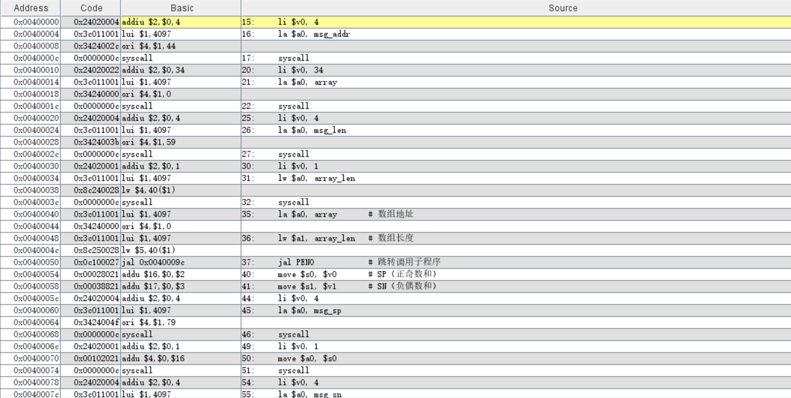
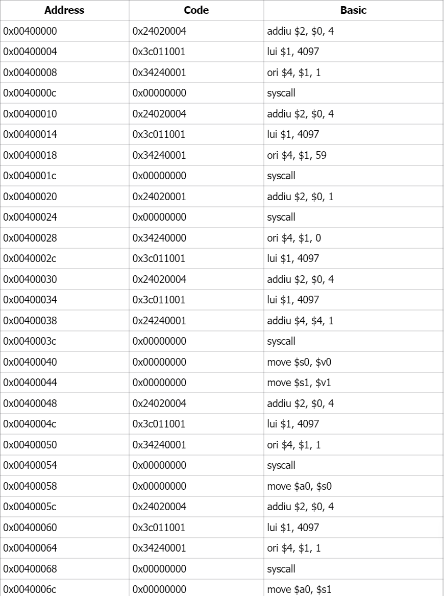
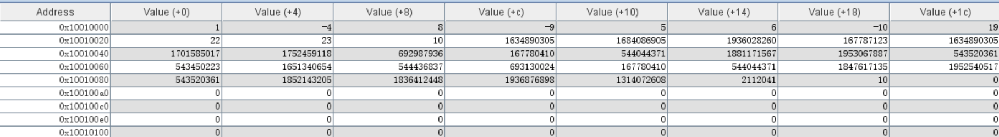
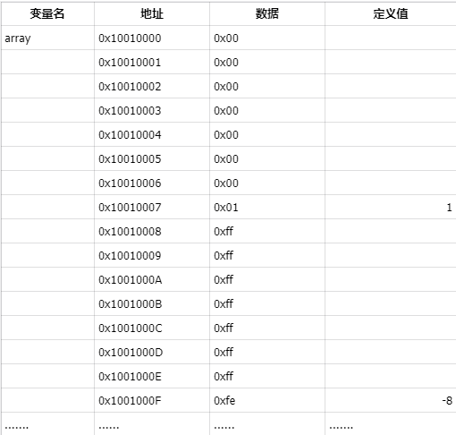
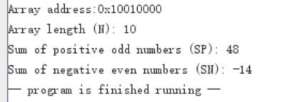

# 微机原理第一次实验报告
通信2303班 岳康 U202314327
## 一、实验任务
* 编写子程序PENO(&X,N,SP,SN)求长度为N的字类型数组X中所有正奇数的和和所有负偶数的和，并分别保存到SP 和SN 中。已知\$a0 保存X 的地址，\$a1 保存数组长度N，正奇数的和保存在\$v0,负偶数的和保存在\$v1 中。并编写主程序验证子程序功能,要求将计算结果输出到console。
* 测试以下数组序列：
int  X[10]={1,-4,8,-9,5,6,-10,19,22,23};
Int  X[10]={121,-124,138,-199,255,2566,-1034,1019,2032,2033};
## 二、实验目的
1. 熟悉常见的MIPS汇编指令
2. 掌握MIPS汇编程序设计
3. 了解MIPS汇编语言与机器语言之间的对应关系
4. 了解C语言语句与汇编指令之间的关系
5. 掌握MARS的调试技术
6. 掌握程序的内存映像
## 三、实验环境
MIPS汇编和运行模拟器 Mars。
采用Java编写，需要J2SE Java运行时环境。
## 四、设计方案
要求正奇数和负偶数的和，则遍历数组，判断为正奇数则加入\$v0中，判断为负偶数则加入\$v1中
## 五、实验源代码
```
.data
    array:      .word 1,-4,8,-9,5,6,-10,19,22,23   # 数组
    array_len:  .word 10                          # 数组长度
    msg_addr:   .asciiz "Array address:"          # 显示数组地址的提示语
    msg_len:    .asciiz "\nArray length (N): "    # 显示数组长度的提示语
    msg_sp:     .asciiz "\nSum of positive odd numbers (SP): "  # 显示正奇数和
    msg_sn:     .asciiz "\nSum of negative even numbers (SN): " # 显示负偶数和
    newline:    .asciiz "\n"
 
.text
.globl main
 
main:
    # 打印数组地址提示语
    li $v0, 4
    la $a0, msg_addr
    syscall

    # 打印数组的实际地址
    li $v0, 34        
    la $a0, array
    syscall

    # 打印数组长度提示语
    li $v0, 4
    la $a0, msg_len
    syscall

    # 打印数组长度 N
    li $v0, 1
    lw $a0, array_len
    syscall

    # 调用子程序 PENO(&array, N, SP, SN)
    la $a0, array       # 数组地址
    lw $a1, array_len   # 数组长度
    jal PENO            # 跳转调用子程序

    # 将返回值保存到 $s0（SP）和 $s1（SN）
    move $s0, $v0       # SP（正奇数和）
    move $s1, $v1       # SN（负偶数和）

    # 打印 SP 提示语
    li $v0, 4
    la $a0, msg_sp
    syscall

    # 打印 SP 值
    li $v0, 1
    move $a0, $s0
    syscall

    # 打印 SN 提示语
    li $v0, 4
    la $a0, msg_sn
    syscall

    # 打印 SN 值
    li $v0, 1
    move $a0, $s1
    syscall

    # 退出程序
    li $v0, 10
    syscall
 
===== PENO 子程序 =====
输入：$a0 = 数组地址，$a1 = 数组长度 N
输出：$v0 = SP（正奇数的和），$v1 = SN（负偶数的和）
PENO:
    li $v0, 0           # 初始化 SP = 0
    li $v1, 0           # 初始化 SN = 0
    li $t0, 0           # 初始化 i = 0（循环计数器）
 
peno_loop:
    bge $t0, $a1, peno_end  # 如果 i >= N，跳出循环

    lw $t1, 0($a0)          # 加载数组元素 X[i]

    # 先判断是否为正奇数
    ble $t1, $0, check_negative_even  # 如果 X[i] <= 0，跳过，进入检测负偶数
    andi $t2, $t1, 1        # 与1按位与，检查是否为奇数（最低位为 1）
    beq $t2, $0, check_negative_even  # 是偶数，跳过，进入检测负偶数
    add $v0, $v0, $t1       # SP += X[i]
    j next_element          # 跳到下一个元素
 
check_negative_even:
    bge $t1, $0, next_element  # 如果 X[i] >= 0，则此元素为0，跳过，进入下一个元素的检测
    andi $t2, $t1, 1        # 检查是否为奇数（最低位为 1）
    bne $t2, $0, next_element  # 如果是奇数，跳过
    add $v1, $v1, $t1       # SN += X[i]
 
next_element:
    addi $a0, $a0, 4        # 指针移动到下一个数组元素（每个元素占4字节）
    addi $t0, $t0, 1        # i++
    j peno_loop             # 回到循环开始
 
peno_end:
    jr $ra                  # 返回主程序
```
# 六、实验结果
1. 程序代码段映像



2. 程序数据段映像



3. 输入输出端口测试：
- 输入：{1,-4,8,-9,5,6,-10,19,22,23}
- 输出：

     
  
- 输入：{121,-124,138,-199,255,2566,-1034,1019,2032,2033}
- 输出：

     

## 七、心得体会
本次实验使用了Mars软件进行汇编语言的学习和练习，学会了使用syscall来进行数据的输入和输出，第一次直观地感受了汇编语言的撰写、与人进行交互的过程，收获很大！
