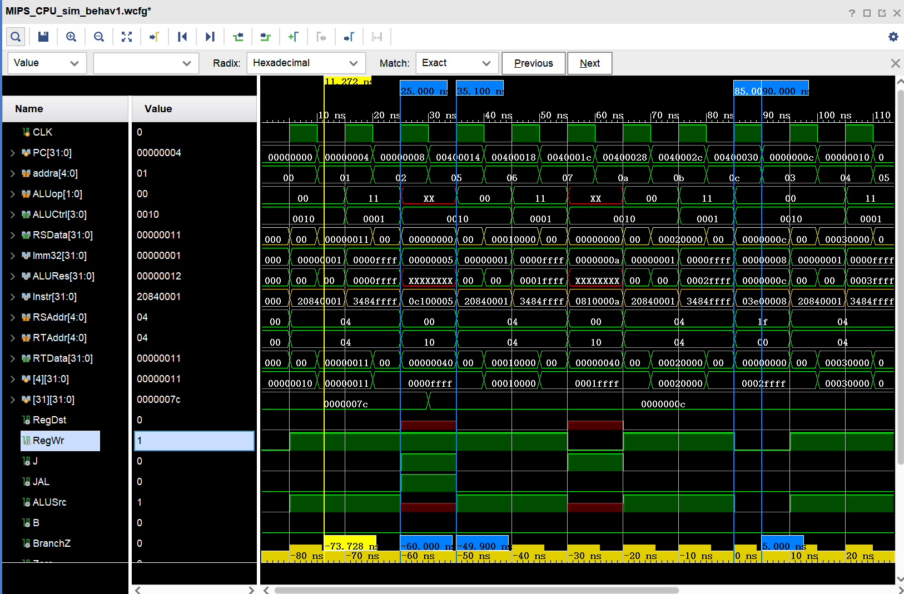

# 实验二：简单指令集MIPS单周期微处理器设计

专业班级：**通信2303班**

姓名：        **岳康**

学号：        **U202314327**

## 一、实验名称

简单指令集MIPS单周期微处理器设计

## 二、实验目的

1. 了解微处理器的基本结构

2. 掌握哈佛结构的计算机工作原理

3. 学会设计简单的微处理器

4. 了解软件控制硬件工作的基本原理

## 三、实验仪器

***Vivado2018.03 、Mars MIPS汇编编译器、Visual Studio Code Insiders***

## 四、实验任务

**全部采用Verilog 硬件描述语言**设计实现简单指令集MIPS 微处理器，要求：

- 指令存储器在时钟上升沿读出指令，
- 指令指针的修改、寄存器文件写入、数据存储器数据写入都在时钟下降沿完成
- 完成完整设计代码输入、各模块完整功能仿真，整体仿真，验证所有指令执行情况。

**且：**

- 假定所有通用寄存器复位时取值都为各自寄存器编号乘以4；
- PC寄存器初始值为0；
- 数据存储器和指令存储器容量大小为32*32，且地址都从0开始；
- 指令存储器初始化时装载测试MIPS汇编程序的机器指令 
- 数据存储器所有存储单元的初始值为其对应地址的取值。数据存储器的地址都是4的整数倍。

仿真以下MIPS汇编语言程序段的执行流程：

```nasm
main: 
 add $4, $2, $3
 lw $4, 4($2)
 sw $5, 8($2)
 sub $2, $4, $3
 or $2, $4, $3
 and $2, $4, $3
 slt $2, $4, $3
 beq $3, $3, equ
 lw $2, 0($3)
 equ: beq $3, $4, exit
 sw $2, 0($3)
 exit: j main
```

另：各个小组所属成员需扩展实现各小组要求扩展的指令：

- 1）addi，ori； 
- 2）lb，lbu，lh，lhu；
- 3）bne；bltz；bgez；
- 4）jal，jr;

在汇编程序中添加相应指令仿真验证该指令执行是否正确。

## 五、实验过程

### （一）生成机器码和iromIP核

根据上述要求，我为第（1）和（4）组指令设计了拓展功能，并将其添加进汇编指令代码中，如下：

```nasm
main:

addi $4, $4, 1 
ori  $4, $4, 0x0000ffff 
jal jump

addi $4, $4, 1 
ori  $4, $4, 0x0000ffff 

jump:
addi $4, $4, 1 
ori  $4, $4, 0x0000ffff 
j jump2

addi $4, $4, 1 
ori  $4, $4, 0x0000ffff 

jump2:
addi $4, $4, 1 
ori  $4, $4, 0x0000ffff 
jr $ra

```

用mars软件转换机器码如下：

```binary
20840001
3484ffff
0c100005
20840001
3484ffff
20840001
3484ffff
0810000a
20840001
3484ffff
20840001
3484ffff
03e00008
```

生成如下.coe文件：

my_task_two.coe

```binary
memory_initialization_radix=16;
memory_initialization_vector=
20840001
3484ffff
0c100005
20840001
3484ffff
20840001
3484ffff
0810000a
20840001
3484ffff
20840001
3484ffff
03e00008;
```

使用Vivado的**IPCatalog**功能，选择**Block Memory Generator**，将要生成的IP核命名为iromIP，Interface Type选择本地接口，memory Type选择Single Port ROM，更改读写宽深均为32，更改为总是使能，最后将生成好的my_task_two.coe导入该IP核中，完成生成。后续我们将使用该IP核作为指令储存器

### （二）拓展设计说明
1. **立即数操作指令拓展（addi，ori）**
- Mainctr
```verilog

case (opCode)
    //......

    //I型指令
    6'b00_1000:outputTemp = 9'b0101_000_10;//addi指令
    6'b00_1101:outputTemp = 9'b0101_000_11;//ori指令，
    6'b10_0011:outputTemp = 9'b0111_000_00;// lw指令
    6'b10_1011:outputTemp = 9'bx1x0_100_00;// sw指令

    //......
endcase
```
- ALUctr
`lw, sw，addi`三个指令都是做加法操作，合并到一起
`ori`做或运算，单独分配11的ALUop值
```verilog
casex ({ALUop,func})
            8'b00xx_xxxx: ALUCtrl = 4'b0010;// lw, sw，addi
            8'b11xx_xxxx: ALUCtrl = 4'b0001; // ori
        //......
endcase
```

2. **跳转指令操作拓展（jal，jr, j）**

    a. jr指令

- 顶层模块部分
```verilog
    always @(negedge CLK)
        begin
            // 1. 同步复位：如果 reset 为 1，就把 PC 清零，回到地址 0
            if (reset) PC <= 0;

            // 2. jr 指令处理把 PC 设为寄存器 RSData 的值，实现“寄存器跳转”（jump register）
            else if (Instr[31:26] == 6'b000000 && Instr[5:0] == 6'b001000 )//jr指令
                PC <= RSData;
                
            else PC <= TempPC;
        end
```


    b. jal指令
- 顶层模块部分
```verilog
    assign RegWriteAddr = (JAL) ? 5'b11111 ://寄存器文件的写入地址选择信号,JAL指令的处理
                      (RegDst ? Instr[15:11] : Instr[20:16]);
    assign RegWriteData = (JAL) ? SequencePC : //寄存器文件的写入数据选择信号，JAL指令的处理
                      (Mem2Reg ? loadData : ALURes);
```


    c. j指令
- Mainctrl部分
```verilog
    always @(opCode) begin
        case (opCode)


             //I型指令
            6'b00_1000:outputTemp = 11'b0_1_0101_000_00;//addi指令
            6'b00_1101:outputTemp = 11'b0_0_0101_000_11;//ori指令，
            6'b10_0011:outputTemp = 11'b0_1_0111_000_00;// lw指令
            6'b10_1011:outputTemp = 11'b0_1_x1x0_100_00;// sw指令

             // 跳转指令
            6'b00_0010:outputTemp = 11'b0_x_xxx0_001_xx;// j指令
            6'b00_0011:outputTemp = 11'b1_x_xxx1_001_xx;//jal指令
            //jr指令实现在顶层模块中

```

- Mainctrl部分
```verilog
    always @(opCode) begin
        case (opCode)


             //I型指令
            6'b00_1000:outputTemp = 11'b0_1_0101_000_00;//addi指令
            6'b00_1101:outputTemp = 11'b0_0_0101_000_11;//ori指令，
            6'b10_0011:outputTemp = 11'b0_1_0111_000_00;// lw指令
            6'b10_1011:outputTemp = 11'b0_1_x1x0_100_00;// sw指令

             // 跳转指令
            6'b00_0010:outputTemp = 11'b0_x_xxx0_001_xx;// j指令
            6'b00_0011:outputTemp = 11'b1_x_xxx1_001_xx;//jal指令
            //jr指令实现在顶层模块中

```
### （三）总体源代码

#### ALU.v

```verilog
module ALU(
    input signed [31:0] inputA,
    input signed [31:0] inputB,
    input [3:0] ALUCtrl,
    output reg [31:0] ALUResult,
    output reg  zero
    );
    
    always @(inputA or inputB or ALUCtrl)
        begin
            case (ALUCtrl)
                4'b0110://subtract：beq
                    begin
                        ALUResult = inputA - inputB;
                        zero = (ALUResult == 0) ? 1 : 0;
                    end
                4'b0010://add：addi、lw、sw、lb、lbu、lh、lhu
                    begin
                        ALUResult = inputA + inputB;
                        zero = 0;
                    end
                4'b0000://and
                    begin
                        ALUResult = inputA & inputB;
                        zero = 0;
                    end
                4'b0001://or：ori
                    begin
                        ALUResult = inputA | inputB;
                        zero = 0;
                    end
                4'b0111://set on less than
                    begin
                        ALUResult = (inputA < inputB) ? 1 : 0;
                        zero = 0;
                    end
                default:
                    begin
                        ALUResult = 0;
                        zero = 0;
                    end
            endcase
        end
endmodule
```

#### ALUCtrler.v

```verilog
module ALUCtrler(
    input [1:0] ALUop,
    input [5:0] func,
    output reg [3:0] ALUCtrl
    );
    always @(ALUop or func)
        casex ({ALUop,func})
            8'b00xx_xxxx: ALUCtrl = 4'b0010;// lw, sw，addi，bltz，bgez，lb、lbu、lh、lhu 
            8'b11xx_xxxx: ALUCtrl = 4'b0001; // ori

            8'b01xx_xxxx: ALUCtrl = 4'b0110;// beq, bne执行减法操作
            //beq看zero=1跳转
            //bne看zero=0跳转
            //bltz是看 rs的最高位是否是1
            //bgez是看 rs的最高位是否是0
            
            // R型指令
            8'b10xx_0000: ALUCtrl = 4'b0010;// R型指令-add
            8'b10xx_0010: ALUCtrl = 4'b0110;// R型指令-sub           
            8'b10xx_0100: ALUCtrl = 4'b0000;// R型指令-and
            8'b10xx_0101: ALUCtrl = 4'b0001;// R型指令-or
            8'b10xx_1010: ALUCtrl = 4'b0111;// R型指令-slt
            default: ALUCtrl = 4'b0000;
        endcase
endmodule
```

#### dram.v

```verilog
module dram(
    input CLK,
    input [4:0] addr,
    output [31:0] readData,
    input [31:0] writeData,
    // write ctrl signal
    input MemWR
    
);
    reg [31:0] regs [0:31];
    assign readData = regs[addr];
    // always @(addr or writeData or MemWR)
    always @(negedge CLK)
    // data ram write at CLK's negedge
        if (MemWR)
         regs[addr] = writeData;

    integer i;
    initial
        for (i = 0; i < 32;i = i + 1) begin
            //初始化数据存储器的值为对应地址的取值（编号乘4，因为地址是4的倍数）
            regs[i] = i * 4;
        end
endmodule
```


#### MainCtrl.v

```verilog
`timescale 1ns / 1ps

module MainCtrl(
    input [31:0] MachineCode,
    output [1:0] ALUop,
    output RtDst,
    output regWr,
    output Imm,
    output memWr,
    output B,
    output J,
    output M2R,
    output SignedExtendType, //控制符号扩展还是零扩展
    output JAL
    //output BranchWhenZero,
    );

    wire [5:0] opCode;
    assign opCode = MachineCode[31:26];

    reg [10:0] outputTemp;
    assign JAL = outputTemp[10];
    assign SignedExtendType = outputTemp[9];
    assign RtDst = outputTemp[8];
    assign Imm = outputTemp[7];
    assign M2R = outputTemp[6];
    assign regWr = outputTemp[5];
    assign memWr = outputTemp[4];
    assign B = outputTemp[3];
    assign J = outputTemp[2];
    assign ALUop = outputTemp[1:0];

    always @(opCode) begin
        case (opCode)

             //I型指令
            6'b00_1000:outputTemp = 11'b0_1_0101_000_00;//addi指令
            6'b00_1101:outputTemp = 11'b0_0_0101_000_11;//ori指令，
            6'b10_0011:outputTemp = 11'b0_1_0111_000_00;// lw指令
            6'b10_1011:outputTemp = 11'b0_1_x1x0_100_00;// sw指令

             // 跳转指令
            6'b00_0010:outputTemp = 11'b0_x_xxx0_001_xx;// j指令
            6'b00_0011:outputTemp = 11'b1_x_xxx1_001_xx;//jal指令
            //jr指令实现在顶层模块中

            default: outputTemp = 11'b0_0_0000_000_00;
        endcase
    end
endmodule
```

#### RegFile.v

```verilog
module RegFile(
    input [4:0] RSAddr,
    input [4:0] RTAddr,
    input [4:0] WriteAddr,
    input RegWr,

    input [31:0] WriteData,
    input CLK,
    input reset,
    output [31:0] RSData,

    output [31:0] RTData
    );
    reg [31:0] regs[0:31];
    assign RSData = (RSAddr == 5'b0) ? 32'b0 : regs[RSAddr];
    assign RTData = (RTAddr == 5'b0) ? 32'b0 : regs[RTAddr];
    integer i;
    // Register file write at CLK's negedge
    always @(negedge CLK)
        if (!reset && RegWr)
            regs[WriteAddr] = WriteData;
        else if (reset)// reset为1
            for (i = 0; i < 32; i = i + 1)
                regs[i] = i*4;
endmodule
```

#### MIPS_CPU.v

```verilog
module MIPS_CPU(
    // clock signal and reset siganl
    input CLK,
    input reset
    );

    // signal bus
    wire [31:0] loadData,TempPC,MuxPC,JumpPC,BranchPC,SequencePC,Imm32,ImmL2,RegWriteData,RSData,RTData,ALUIn2,ALURes,MemoryReadData,Instr;
    wire [4:0] RegWriteAddr;
    wire [27:0] PsudeoPC;

    // signal bit control signal
    wire BranchZ,J,B,Zero,RegDst,RegWr,ALUSrc,MemWR,Mem2Reg,SignedExtendType,BranchWhenZero;
    
    // ALU operation control number
    wire [1:0] ALUop;
    wire [3:0] ALUCtrl;

    // program register
    reg [31:0] PC;

    assign BranchPC = ImmL2 + SequencePC;//分支跳转指令的目标地址
    assign BranchZ = B & (Zero == BranchWhenZero);//分支跳转指令的控制信号

    assign SequencePC = (reset == 0) ? (PC + 4) : 32'b0;
    assign PsudeoPC = {Instr[25:0],2'b00};
    assign JumpPC = {SequencePC[31:28],PsudeoPC};
    assign MuxPC = BranchZ ? BranchPC : SequencePC;//复选器2：分支跳转指令目标地址与顺序执行地址
    assign TempPC = J ? JumpPC : MuxPC;//复选器3：J型指令选择


    assign ImmL2 = {Imm32[29:0],2'b00};

    //assign Imm32 = {{16{Instr[15]}},Instr[15:0]} ;//立即数拓展
    assign Imm32 = SignedExtendType ? {{16{Instr[15]}},Instr[15:0]} : {16'b0,Instr[15:0]};//立即数拓展
    assign ALUIn2 = ALUSrc ? Imm32 : RTData;

    assign RegWriteAddr = (JAL) ? 5'b11111 ://寄存器文件的写入地址选择信号,JAL指令的处理
                      (RegDst ? Instr[15:11] : Instr[20:16]);
    assign RegWriteData = (JAL) ? SequencePC : //寄存器文件的写入数据选择信号，JAL指令的处理
                      (Mem2Reg ? loadData : ALURes);

    iromIP unitIrom ( .clka(CLK),.addra(PC[6:2]),.douta(Instr)  );//PC[6:2]为指令索引的地址位（实际地址除以4，即右移两位）
    //iprom_new iprom_new (  .a(PC[6:2]),  .spo(Instr) );
    RegFile unitRegFile(Instr[25:21],Instr[20:16],RegWriteAddr,RegWr, RegWriteData,CLK,reset,RSData, RTData);
    ALU unitALU(RSData,ALUIn2,ALUCtrl,ALURes,Zero);
    dram unitDram(CLK,ALURes[6:2],MemoryReadData,RTData,MemWR);//ALURes[6:2]为数据存储器的地址位(编号)（实际地址除以4）
    LoadExtender unitLoadExtender(MemoryReadData,Instr[31:26],ALURes[1:0],loadData);//加载指令拓展与lw实现

    
    MainCtrl unitMainCtrl(Instr[31:0],ALUop,RegDst,RegWr,ALUSrc,MemWR,B,J,Mem2Reg,SignedExtendType,JAL);
    ALUCtrler unitALUCtrl(ALUop,(ALUSrc && Instr[31:26] == 6'b00_1101 ? 6'bxx_0101:Instr[5:0]),ALUCtrl);

    always @(negedge CLK)
        begin
            // 1. 同步复位：如果 reset 为 1，就把 PC 清零，回到地址 0
            if (reset) PC <= 0;

            // 2. jr 指令处理把 PC 设为寄存器 RSData 的值，实现“寄存器跳转”（jump register）
            else if (Instr[31:26] == 6'b000000 && Instr[5:0] == 6'b001000 )//jr指令
                PC <= RSData;
                
            else PC <= TempPC;
        end
endmodule
```

### 仿真代码

#### RegFileSim.v

```verilog
`timescale 1ns / 1ps

module RegFileSim(
    output [31:0] RSData,
    output [31:0] RTData
    );
    reg [4:0] RSAddr;
    reg [4:0] RTAddr;
    reg [4:0] WriteAddr;
    reg RegWr;
    reg [31:0] WriteData;
    reg CLK;
    reg reset;
    parameter PERIOD = 10;

    RegFile U0(RSAddr,RTAddr,WriteAddr,RegWr,WriteData,
               CLK,reset,RSData,RTData);

    always begin
        CLK = 1'b0;
        #(PERIOD/2) CLK = 1'b1;
        #(PERIOD/2);
    end

    initial
        begin
        reset = 1;
        RSAddr = 5'h0;
        RTAddr = 5'h0;
        #15
        reset = 0;
        #30
        RegWr = 1;
        WriteAddr = 5'h03;
        WriteData = 32'h5aa5;
        #20
        RSAddr = 5'h03;
        RTAddr = 5'h03;
        end

endmodule
```

得到仿真波形：


#### ALUsim.v

```verilog
`timescale 1ns / 1ps

module ALUsim(
    output [31:0] Res,
    output zero
    );
    reg [31:0] inputA;
    reg [31:0] inputB;
    reg [3:0] ALUCtrl;

    ALU U0(inputA,inputB,ALUCtrl,Res,zero);
    initial begin
        inputA = 32'hffff_0000;
        inputB = 32'h00ff_ff00;
        ALUCtrl = 4'h2;
        #10
        ALUCtrl = 4'h6;
        #10
        ALUCtrl = 4'h0;
        #10
        ALUCtrl = 4'h1;
        #10
        ALUCtrl = 4'h7;
    end
endmodule
```

得到仿真波形：


#### MIPS_CPU_sim.v

```verilog
module MIPS_CPU_sim(

    );
    reg CLK,reset;
    MIPS_CPU u0(CLK,reset);
    parameter PERIOD = 10;

    always begin
        CLK = 1'b0;
        #(PERIOD/2) CLK = 1'b1;
        #(PERIOD/2);
    end

    initial
        begin
            reset = 1;
            #5
            reset = 0;
        end
endmodule
```

得到仿真波形：



### 顶层文件仿真结果分析

对MIPS_CPU的仿真得到如上波形，下面将分析扩展功能：

#### （1）addi与ori功能分析
`addi $4, $4, 1`和`ori  $4, $4`

对应机器码为：

`20840001`和`3484ffff`

在波形窗口中，我们可以看到，5ns时钟上升沿时，获取指令 `addi $4, $4, 1`，将4号寄存器中的值`0x0000_0010`和立即数`1`（十进制）相加得到值`0x0000_0011`；在10ns时钟下降沿时，将值`0x0000_0011`写入寄存器\$1中，**执行正确**；

15ns时，获取指令`ori  $4, $4, 0x0000ffff`，将4号寄存器中的值`0x0000_0011`和立即数`0x0000ffff`进行或运算，得到值`0x0000_ffff`；20ns时，在CLK下降沿作用下将值`0x0000_ffff`写入寄存器\$4中，**执行正确**。

对MIPS_CPU的仿真得到如上波形，下面将分析跳转指令 `jal`、`j` 和 `jr` 的执行：


#### （2）jr、jal、j功能分析
1. **jal jump**

对应机器码为：`0c100005`  
在 `35ns` 左右的时钟上升沿处，获取 `jal` 指令，此时：

- `JAL=1`，说明识别为 `jal` 指令；
- `RegDst=0`，跳转返回地址写入寄存器 `$31`；
- `RegWr=1`，即将返回地址写入 `$31`；
- 从波形中可以看到，返回地址值为 `0000000c`（即 PC=下一条指令地址 `0x0000000c`），已成功写入 `$31`，验证 `jal` 功能 **正确执行**。

2. **j jump2**

对应机器码为：`0810000a`  
在 `45ns` 左右的时钟上升沿处，获取 `j` 指令：

- `J=1`，说明识别为 `j` 指令；
- `RegWr=0`，说明不会写寄存器；
- 波形中可看到 `PC` 跳转到了目标地址 `0x00000028`（即 jump2 标签的指令地址），说明跳转 **执行成功**。

3. **jr $ra**

对应机器码为：`03e00008`  
在 `85ns` 左右时钟上升沿，获取 `jr` 指令：

- `ALUop=00`，符合 `jr` 操作的判断方式；
- 此时 `RSAddr = 0x1f`，也就是 `$ra`，其值为 `0x0000000c`；
- 从波形中可看到下一条指令地址 `PC=0x0000000c`，即跳回 `jal` 返回地址；
- 说明 `jr` 成功完成了跳转，跳转地址取自 `$ra`，功能 **执行正确**。


## 实验小结

在这次实验中，我用verilog语言设计了一个MIPS单周期微处理器，更加深入地理解了MIPS单周期微处理器的运行原理。理解了软件控制硬件的工作原理，也加深了对MIPS微处理器的基本结构与其每个模块工作过程的理解。

由于vivado代码编辑器不支持自动补全，语法高亮也不怎么实用，这对于我一个用习惯了JetBrains编译器的程序员非常不友好，所以我额外配置了VSCode作为写代码的辅助工具，让我的写代码效率快了很多

这次实验收获很大！