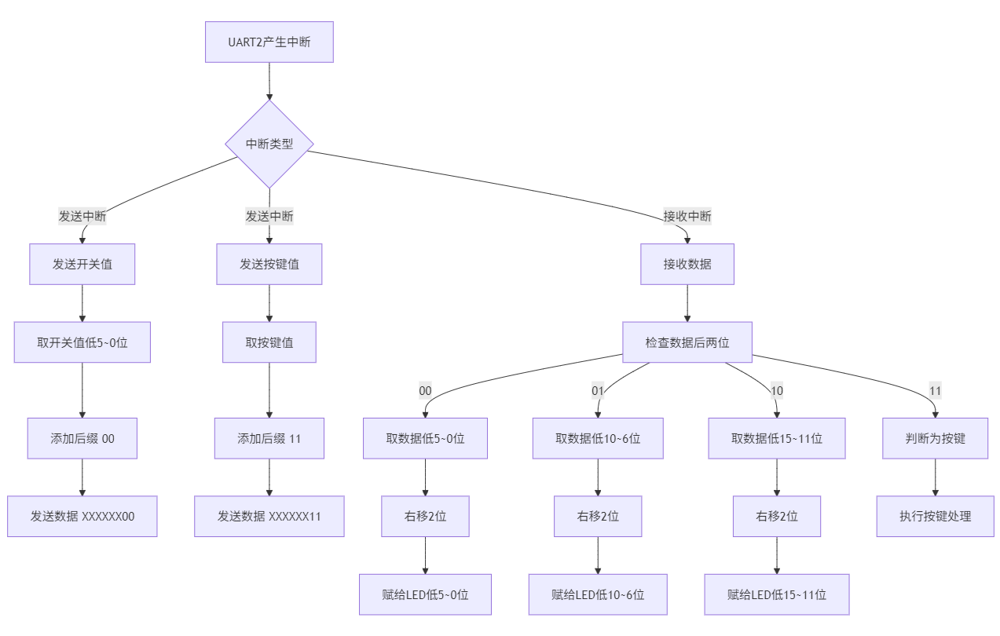

# 实验四：串行IO接口设计

专业班级：**通信2303班**
姓名：        **岳康**
学号：        **U202314327**

## 实验名称

串行IO接口设计

## 实验目的

- 掌握GPIO IP核的工作原理和使用方法
- 掌握中断控制方式的IO接口设计原理
- 掌握中断程序设计方法
- 掌握IO接口程序控制方法

## 实验仪器

***Vivado 2018.3、Vivado SDK***

## 实验任务

- 掌握UART串行接口设计
采用UART IP 核，实现Nexys4 或Nexys4 DDR 实验板UART接口之间的通信。要求当拨动开关时，将开关对应的值通过UART1发送到UART2，同时利用LED 灯指示UART2接收到的当前开关的值；当按下按键时，将按键对应的值通过UART2发送到UART1，同时利用数码管指示UART1接收到的当前按下的按键位置码C,U,d,L,r)。UART 波特率为9600bps。


## 实验原理

### 硬件电路框图


根据硬件电框图搭建的硬件平台整体框图如下：


### 软件流程图



## 实验源码
- UART串行接口
```c
#include "xil_io.h"
#include "stdio.h"
#include "xgpio_l.h"
#include "xintc_l.h"
#include "xtmrctr_l.h"
#include <xuartlite_l.h>

#define RESET_VALUE 100000  // 定时器初始计数值（根据需要设定时间间隔）

// 函数声明
void UART_SEND();                    // UART2 发送函数
void UART_RECV();                    // UART1 接收函数
void Seg_TimerCounterHandler();      // 数码管显示函数（定时器中断）
void BtnHandler();                   // 预留：按键处理函数
void SwitchHandler();                // 预留：拨码开关处理函数
void My_ISR() __attribute__((interrupt_handler));  // 主中断服务程序

// 全局变量定义
int i = 0;  // 用于轮流显示 8 位数码管
unsigned short current_btn, last_btn, real_btn;
char segcode[6] = {0xc6, 0xc1, 0xc7, 0x88, 0xa1, 0xff};  // 数码管段码表
short code[8] = {5, 5, 5, 5, 5, 5, 5, 5};  // 数码管显示的内容，每位初始为 5
int k = 0;  // 输入位置指针
short pos = 0xff7f;  // 数码管位选初始值，逐位移位轮流显示

// 主函数
int main() {

    // 设置 GPIO0：LED（输出）和开关（输入）
    Xil_Out32(XPAR_AXI_GPIO_0_BASEADDR + XGPIO_TRI2_OFFSET, 0x0);     // LED 为输出
    Xil_Out32(XPAR_AXI_GPIO_0_BASEADDR + XGPIO_TRI_OFFSET, 0xffff);   // Switch 为输入

    // 设置 GPIO1：数码管段码和位选为输出
    Xil_Out32(XPAR_AXI_GPIO_1_BASEADDR + XGPIO_TRI_OFFSET, 0x0);
    Xil_Out32(XPAR_AXI_GPIO_1_BASEADDR + XGPIO_TRI2_OFFSET, 0x0);

    // 设置 GPIO2：按钮输入（低5位）
    Xil_Out32(XPAR_AXI_GPIO_2_BASEADDR + XGPIO_TRI_OFFSET, 0x1f);     // Button 为输入

    // 配置定时器
    Xil_Out32(XPAR_AXI_TIMER_0_BASEADDR + XTC_TCSR_OFFSET,
              Xil_In32(XPAR_AXI_TIMER_0_BASEADDR + XTC_TCSR_OFFSET) & ~XTC_CSR_ENABLE_TMR_MASK);  // 先停止定时器
    Xil_Out32(XPAR_AXI_TIMER_0_BASEADDR + XTC_TLR_OFFSET, RESET_VALUE);  // 设置初始计数值，写入TLR中
    Xil_Out32(XPAR_AXI_TIMER_0_BASEADDR + XTC_TCSR_OFFSET,
              Xil_In32(XPAR_AXI_TIMER_0_BASEADDR + XTC_TCSR_OFFSET) | XTC_CSR_LOAD_MASK);  // 加载 TLR 值进入TCSR
    Xil_Out32(XPAR_AXI_TIMER_0_BASEADDR + XTC_TCSR_OFFSET,
              (Xil_In32(XPAR_AXI_TIMER_0_BASEADDR + XTC_TCSR_OFFSET) & ~XTC_CSR_LOAD_MASK) |
              XTC_CSR_ENABLE_TMR_MASK | XTC_CSR_AUTO_RELOAD_MASK | XTC_CSR_ENABLE_INT_MASK | XTC_CSR_DOWN_COUNT_MASK);  // 启动定时器

    // 使能 UART 中断，清空 FIFO
    Xil_Out32(XPAR_AXI_UARTLITE_1_BASEADDR + XUL_CONTROL_REG_OFFSET,
              XUL_CR_ENABLE_INTR | XUL_CR_FIFO_RX_RESET | XUL_CR_FIFO_TX_RESET);
    Xil_Out32(XPAR_AXI_UARTLITE_2_BASEADDR + XUL_CONTROL_REG_OFFSET,
              XUL_CR_ENABLE_INTR | XUL_CR_FIFO_RX_RESET | XUL_CR_FIFO_TX_RESET);

    // 中断控制器使能三种中断源：定时器、UART1、UART2
    Xil_Out32(XPAR_AXI_INTC_0_BASEADDR + XIN_IER_OFFSET,
              XPAR_AXI_TIMER_0_INTERRUPT_MASK |
              XPAR_AXI_UARTLITE_1_INTERRUPT_MASK |
              XPAR_AXI_UARTLITE_2_INTERRUPT_MASK);

    // 启用中断控制器：主中断使能 + 硬件中断使能
    Xil_Out32(XPAR_AXI_INTC_0_BASEADDR + XIN_MER_OFFSET,
              XIN_INT_MASTER_ENABLE_MASK | XIN_INT_HARDWARE_ENABLE_MASK);
    microblaze_enable_interrupts();  // 允许 CPU 接收中断

    UART_SEND();  // 主动执行一次 UART2 数据发送
    return 0;
}

// 全局中断服务程序（中断入口函数）
void My_ISR() {
    int status;
    status = Xil_In32(XPAR_AXI_INTC_0_BASEADDR + XIN_ISR_OFFSET);  // 读取中断状态

    // 判断定时器中断是否发生
    if (status & XPAR_AXI_TIMER_0_INTERRUPT_MASK) {
        Seg_TimerCounterHandler();
    }

    // 判断 UART2 发送中断
    if (status & XPAR_AXI_UARTLITE_2_INTERRUPT_MASK) {      UART_SEND();
    }
    // 判断 UART1 接收中断
    else if (status & XPAR_AXI_UARTLITE_1_INTERRUPT_MASK) {
        UART_RECV();
    }

    // 清除中断状态
    Xil_Out32(XPAR_AXI_INTC_0_BASEADDR + XIN_IAR_OFFSET, status);
}

// UART2 发送函数：读取拨码开关和按键状态，拆分分批发送，因为uart的一次发送的data位宽只有8位，一次发不完
void UART_SEND() {
    u32 sw_val = Xil_In32(XPAR_AXI_GPIO_0_BASEADDR + XGPIO_DATA_OFFSET);
    u32 btn_val = Xil_In32(XPAR_AXI_GPIO_2_BASEADDR + XGPIO_DATA_OFFSET);

    while (Xil_In32(XPAR_AXI_UARTLITE_2_BASEADDR + XUL_STATUS_REG_OFFSET) & XUL_SR_TX_FIFO_FULL);//判断TX非满才写入数据，防止数据丢失
    // 将拨码开关 0~5 位数据左移两位后发送，低两位为 00，表示类型
    Xil_Out32(XPAR_AXI_UARTLITE_2_BASEADDR + XUL_TX_FIFO_OFFSET, ((sw_val & 0x3f) << 2) | 0x0);

    while (Xil_In32(XPAR_AXI_UARTLITE_2_BASEADDR + XUL_STATUS_REG_OFFSET) & XUL_SR_TX_FIFO_FULL);
    // 发送拨码开关 6~10 位，编码为类型 01（0x1）
    Xil_Out32(XPAR_AXI_UARTLITE_2_BASEADDR + XUL_TX_FIFO_OFFSET, ((sw_val >> 4) & 0x7c) | 0x1);

    while (Xil_In32(XPAR_AXI_UARTLITE_2_BASEADDR + XUL_STATUS_REG_OFFSET) & XUL_SR_TX_FIFO_FULL);
    // 发送拨码开关 11~15 位，编码为类型 10（0x2）
    Xil_Out32(XPAR_AXI_UARTLITE_2_BASEADDR + XUL_TX_FIFO_OFFSET, ((sw_val >> 9) & 0x7c) | 0x2);

    while (Xil_In32(XPAR_AXI_UARTLITE_2_BASEADDR + XUL_STATUS_REG_OFFSET) & XUL_SR_TX_FIFO_FULL);
    // 发送按键信息（低 5 位）编码为类型 11（0x3）
    Xil_Out32(XPAR_AXI_UARTLITE_2_BASEADDR + XUL_TX_FIFO_OFFSET, (btn_val << 2) | 0x3);
}

// UART1 接收函数：解析数据，更新开关或按键对应处理
void UART_RECV() {
    static u32 sw = 0;   // 保存当前开关状态
    static u32 btn = 0;  // 保存上一次按键状态

    // 判断 UART1 FIFO 是否有有效数据
    if ((Xil_In32(XPAR_AXI_UARTLITE_1_BASEADDR + XUL_STATUS_REG_OFFSET) & XUL_SR_RX_FIFO_VALID_DATA) == XUL_SR_RX_FIFO_VALID_DATA) {
        u32 tmp = Xil_In32(XPAR_AXI_UARTLITE_1_BASEADDR + XUL_RX_FIFO_OFFSET);

        switch (tmp & 0x3) {  // 根据低两位判断数据类型
        case 0:  // 开关 0~5
            sw &= 0xffc0;
            sw |= tmp >> 2;
            Xil_Out32(XPAR_AXI_GPIO_0_BASEADDR + XGPIO_DATA2_OFFSET, sw);
            break;
        case 0x1:  // 开关 6~10
            sw &= 0xf83f;
            sw |= (tmp & 0x7c) << 4;
            Xil_Out32(XPAR_AXI_GPIO_0_BASEADDR + XGPIO_DATA2_OFFSET, sw);
            break;
        case 0x2:  // 开关 11~15
            sw &= 0x7ff;
            sw |= (tmp & 0x7c) << 9;
            Xil_Out32(XPAR_AXI_GPIO_0_BASEADDR + XGPIO_DATA2_OFFSET, sw);
            break;
        case 0x3:  // 按键处理
            if (btn == ((tmp & 0x7c) >> 2)) return;  // 按键状态无变化则退出
            btn = (tmp & 0x7c) >> 2;
            switch (btn) {
            case 0x01: code[k] = 0; break;
            case 0x02: code[k] = 1; break;
            case 0x04: code[k] = 2; break;
            case 0x08: code[k] = 3; break;
            case 0x10: code[k] = 4; break;
            default: break;
            }
            k = (k + 1) % 8;
            break;
        }
    }

    // 重启接收和发送，避免遗留脏数据
    Xil_Out32(XPAR_AXI_UARTLITE_1_BASEADDR + XUL_CONTROL_REG_OFFSET,
              XUL_CR_ENABLE_INTR | XUL_CR_FIFO_RX_RESET | XUL_CR_FIFO_TX_RESET);
}

// 定时器中断处理函数：驱动数码管显示
void Seg_TimerCounterHandler() {
    // 显示当前位的数码管值
    Xil_Out32(XPAR_AXI_GPIO_1_BASEADDR + XGPIO_DATA2_OFFSET, segcode[code[(i + k) % 8]]);
    Xil_Out32(XPAR_AXI_GPIO_1_BASEADDR + XGPIO_DATA_OFFSET, pos);

    // 下一个数码管位置（右移）
    pos = pos >> 1;
    i++;
    if (i == 8) {
        i = 0;
        pos = 0xff7f;  // 重置位置
    }

    // 重置定时器寄存器（清中断标志位）
    Xil_Out32(XPAR_AXI_TIMER_0_BASEADDR + XTC_TCSR_OFFSET,
              Xil_In32(XPAR_AXI_TIMER_0_BASEADDR + XTC_TCSR_OFFSET));
}

```

- .xdc文件
```py
set_property -dict { PACKAGE_PIN K1    IOSTANDARD LVCMOS33 } [get_ports { rx1 }]; #IO_L23N_T3_35 Sch=jc[1]
set_property -dict { PACKAGE_PIN F6    IOSTANDARD LVCMOS33 } [get_ports { tx1 }]; #IO_L19N_T3_VREF_35 Sch=jc[2]

#Pmod Header JD

set_property -dict { PACKAGE_PIN H4    IOSTANDARD LVCMOS33 } [get_ports { rx2 }]; #IO_L21N_T3_DQS_35 Sch=jd[1]
set_property -dict { PACKAGE_PIN H1    IOSTANDARD LVCMOS33 } [get_ports { tx2 }]; #IO_L17P_T2_35 Sch=jd[2]
```
## 实验结果

- 首先断开UART2的TX和UART的RT之间的连线，拨动开关和按下按键，LED灯和数码管都没变化。
](image/20250529211854.png)
- 连接上连接UART2的TX和UART的RT之间的连线后，再次拨动开关，对应的LED灯被点亮，按下开关后数码管亮起了最近按下的开关对应的字符，所以实验结果满足要求。


## 实验小结
在调试过程中，遇到了一些问题，例如UART数据位宽限制导致需要分批发送数据、数码管显示内容的刷新时序控制等。通过查阅资料和多次实验，逐步解决了这些问题。实验还让我更加熟悉了Vivado SDK的使用流程，虽然其界面和调试体验不如Visual Studio Code顺手，但对于嵌入式开发来说，掌握其基本操作是非常必要的。

在本次实验中，UART串行通信的实现是核心难点之一。由于UART每次只能传输8位数据，而实际需要传递的信息（如拨码开关的全部状态）远大于8位，因此必须对数据进行拆分、编码和分批发送。为此，我采用了数据左移和类型后缀编码的方式，将不同类型的数据（如开关的不同位段、按键值）通过不同的编码后缀区分，保证了数据在接收端能够被正确解析和还原。这一过程中，深刻体会到了嵌入式系统中数据打包与协议设计的重要性。

此外，数码管的动态刷新也带来了一定挑战。由于数码管采用动态扫描方式显示，需要通过定时器中断周期性地切换显示内容和位选信号。刚开始时，由于刷新时序控制不当，导致数码管显示出现闪烁或内容错位。通过调整定时器的计数值和优化中断服务程序，最终实现了稳定、清晰的数码管显示效果。这一过程让我更加理解了硬件时序与软件控制之间的关系。

在中断处理方面，实验要求对定时器、UART1和UART2三种中断源进行统一管理。通过编写主中断服务程序（My_ISR），能够根据中断状态寄存器的不同位判断具体的中断来源，并分别调用对应的处理函数。这样既保证了系统的实时响应能力，也提高了代码的可维护性和扩展性。通过本次实验，我对中断优先级、嵌套中断等概念有了更直观的认识。

实验过程中还涉及了GPIO的配置与操作，包括LED、拨码开关、按键和数码管的输入输出设置。通过对Xilinx提供的API函数的学习和应用，掌握了如何通过寄存器操作实现对硬件资源的灵活控制。尤其是在调试过程中，通过不断读取和输出GPIO的状态，有效定位和解决了硬件连接和信号传递中的问题。

本次实验不仅提升了我的硬件编程能力，也锻炼了独立分析和解决问题的能力。在遇到问题时，能够主动查阅相关文档、参考网络资源，并结合实际情况进行调试和优化。整个实验过程加深了我对串行通信、IO接口设计和中断处理机制的理解，也让我体会到理论知识与实际应用之间的紧密联系。

总的来说，本次实验收获颇丰。通过亲自动手设计和调试串行IO接口，不仅巩固了课堂所学知识，还积累了宝贵的实践经验。今后在类似的嵌入式系统开发中，这些经验将为我提供重要的参考和帮助。同时，也激发了我对嵌入式系统和硬件开发更深入学习的兴趣和动力。
